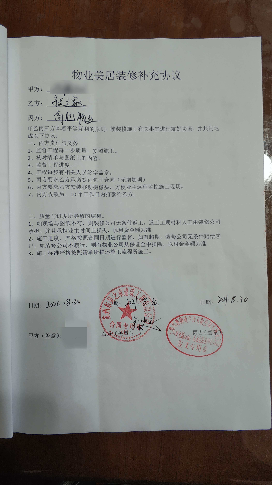
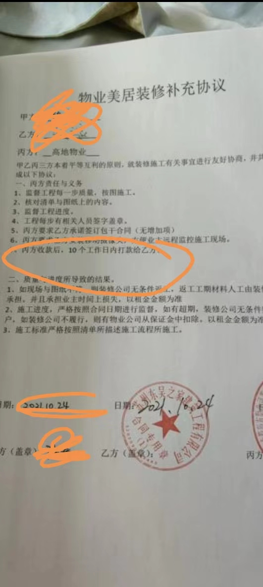
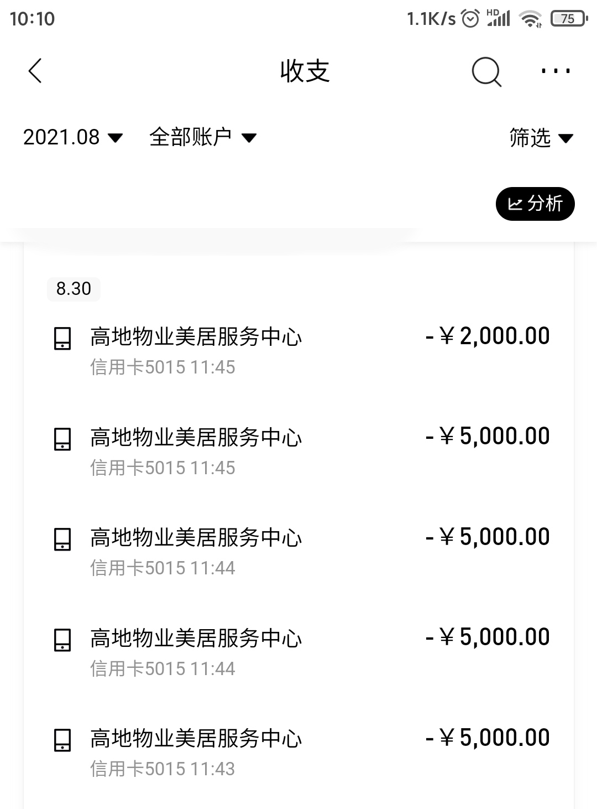

2021年苏州东吴之家建筑工程有限公司与上海高地物业管理有限公司苏州分公司联手发起优惠装修活动，业主XXX则与两个共同签订《住宅装饰工程合同》与《物业美居装修补充协议》。合同中，东吴之家装修公司承诺工期为45天，高地物业则承诺起到监督工程进度及在东吴之家装修公司无法履行合同义务时承担连带赔偿责任。但东吴之家公司一再延误工期，业主XXX多次与其沟通无果，且高地物业在此过程中并没有起到任何监督作用。此外，《物业美居装修补充协议》写到“丙方收款后，10个工作日内打款给乙方”，实际业主XXX两次付款的收款方为“高地物业美居服务中心”及“苏州东吴之家建筑工程”，高地物业完全没有履行作为中间方的监督进度再付款的责任。
业主XXX联合其他受害业主多次电话、书面、报警、法院起诉、仲裁等方式要求东吴之家装修公司和高地物业履行合同或赔偿，但都无果。
收集的部分证据发到网上给大家提前欣赏下。

## 物业美居照片

## 物业交房装修手册

## 装修合同补充协议

## 其他文件

